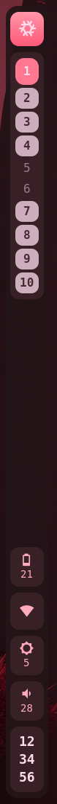
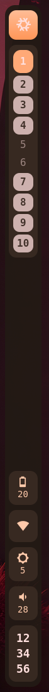
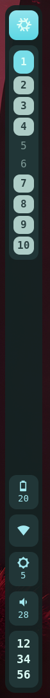
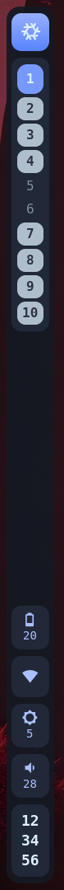
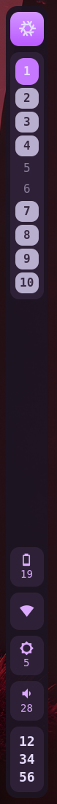
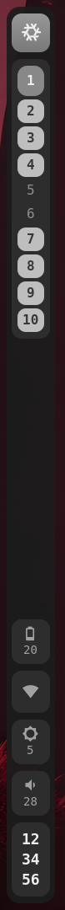

<h1 style="text-align: center" align="center">

`tkbar`

</h1>

    
    
    <!--
    
    -->
    

A minimalist, hardened status bar.

I was personally unsatisfied with the state of wayland bars and shells (bloat, huge attack surface, not enough config options, not handling some protocols, etc.) so I just wrote a minimal thing that worked for me.

Configuration is optional and deliberately limited: a single TOML file can reorder/hide components and set the bar size, everything else is hardcoded on purpose. Fork it if you want to change something deeper or make a PR with proper feature gating.

## Supported compositors

`tkbar` is a Wayland status bar. It currently supports two compositors, selected at build time via Cargo features:

- [niri](https://github.com/YaLTeR/niri) (default)
- [Hyprland](https://github.com/hyprwm/Hyprland)

Other Wayland compositors may be supported in the future through additional workspace backends.

## Dependencies

The bar aims for a minimal dependency tree: every crate and library is code that runs with your full user privileges, so only what is strictly needed is pulled in. There is no logging framework (just `eprintln!`), and config parsing is feature-gated so it can be dropped entirely.

### Build-time

| Dependency | Notes |
| --- | --- |
| Rust (edition 2024) | stable toolchain for builds; nightly only in the devshell for `rustfmt`/`clippy` |
| GTK4 >= 4.12 | C library, resolved through `pkg-config` |
| gtk4-layer-shell >= 1.0 | C library implementing the layer-shell protocol |
| glib | comes with GTK4 |

With the default `config` feature, three direct Rust crates are added: `directories`, `serde`, `toml`. Of these, only `serde` is already present transitively via the default `niri` backend (pulled in by `niri-ipc`), so it adds no new transitive code. `directories` and `toml` are genuinely new dependencies, and `toml` in turn pulls in its own small tree. If you build with the `hyprland` backend instead of `niri`, `serde` is also a new dependency. Build with `--no-default-features` to drop all three entirely: no TOML parser is then linked at all.

### Run-time

| Dependency | How it is used | Trust level |
| --- | --- | --- |
| GTK4 / Pango / Cairo / FreeType | linked, renders everything | large audited C codebase, keep it updated |
| gtk4-layer-shell | linked, positions the window | small C library |
| a Wayland compositor ([niri](https://github.com/YaLTeR/niri) or [Hyprland](https://github.com/hyprwm/Hyprland)) | Wayland protocol | fully trusted, see [SECURITY.md](docs/SECURITY.md) |
| the compositor's IPC (niri IPC / Hyprland IPC) | Unix socket, workspace list/buttons | trusted (it *is* the compositor) |
| `wpctl` (WirePlumber) | spawned to get/set volume and mute | local daemon client, output parsed defensively |
| `brightnessctl` | spawned to set backlight | writes to sysfs, its output is never parsed |
| `iwctl` (iwd) | spawned to read the Wi-Fi state | output parsed, carries untrusted data (SSID) |
| sysfs (`/sys/class/backlight`, `/sys/class/power_supply`, `/sys/class/net`) | read directly | kernel-provided |

All spawned tools are looked up in `PATH`. The Nix package wraps the binary so that `PATH` resolves them from pinned, absolute `/nix/store` paths.

## Configuration

Optional and deliberately limited; the bar falls back to a hardcoded default
when the file is missing. See [docs/CONFIGURATION.md](docs/CONFIGURATION.md) for
the full TOML format, the optional CSS overloading, and how to select a theme or
drop the `config` feature from Nix.

## Security

A status bar runs unsandboxed with your full user privileges, so attack surface
is taken seriously: minimal dependencies, no `unsafe`, no panics on external
data, no network code, no dynamic loading, and a pinned, reproducible build.

See [docs/SECURITY.md](docs/SECURITY.md) for the full threat model, the enforced
security properties, and how to report a vulnerability.
