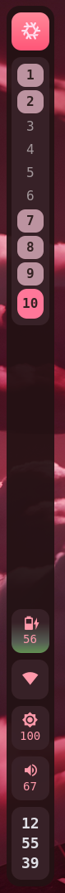
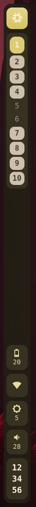
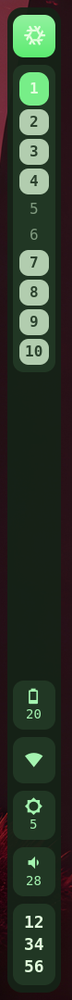

<h1 style="text-align: center" align="center">

`tkbar`

</h1>

A minimalist, hardened status bar.

<p align="center">
    <a href="https://github.com/tkr-sh/tkbar">
        
    </a>
    <a href="https://github.com/tkr-sh/tkbar/actions">
        
    </a>
    <!--
    <a href="https://crates.io/crates/tkbar">
        
    </a>
    -->
    <a href="https://github.com/tkr-sh/tkbar">
        
    </a>
</p>


<div style="display: flex; flex-direction: row">







</div>


I was personally unsatisfied with the state of wayland bars and shells (bloat, huge attack surface, not enough config options, not handling some protocols, etc.) so I just wrote a minimal thing that worked for me.

Configuration is optional and deliberately limited: a single TOML file can reorder/hide components and set the bar size, everything else is hardcoded on purpose. Fork it if you want to change something deeper or make a PR with proper feature gating.

## Dependencies

The bar aims for a minimal dependency tree: every crate and library is code that runs with your full user privileges, so only what is strictly needed is pulled in. There is no logging framework (just `eprintln!`), and config parsing is feature-gated so it can be dropped entirely.

### Build-time

| Dependency | Notes |
| --- | --- |
| Rust (edition 2024) | nightly toolchain pinned via the flake |
| GTK4 >= 4.12 | C library, resolved through `pkg-config` |
| gtk4-layer-shell >= 1.0 | C library implementing the layer-shell protocol |
| glib | comes with GTK4 |

With the default `config` feature, three extra Rust crates are compiled in: `directories`, `serde`, `toml` (all already present in the dependency tree through `niri-ipc`, so they add no new transitive code). Build the bar with `--no-default-features` to exclude them entirely: no TOML parser is then linked at all.

### Run-time

| Dependency | How it is used | Trust level |
| --- | --- | --- |
| GTK4 / Pango / Cairo / FreeType | linked, renders everything | large audited C codebase, keep it updated |
| gtk4-layer-shell | linked, positions the window | small C library |
| a Wayland compositor ([niri](https://github.com/YaLTeR/niri)) | Wayland protocol | fully trusted, see threat model |
| niri IPC | Unix socket, workspace list/buttons | trusted (it *is* the compositor) |
| `wpctl` (WirePlumber) | spawned to get/set volume and mute | local daemon client, output parsed defensively |
| `brightnessctl` | spawned to set backlight | writes to sysfs, its output is never parsed |
| `iwctl` (iwd) | spawned to read the Wi-Fi state | output parsed, carries untrusted data (SSID) |
| sysfs (`/sys/class/backlight`, `/sys/class/power_supply`, `/sys/class/net`) | read directly | kernel-provided |

All spawned tools are looked up in `PATH`. The Nix package wraps the binary so that `PATH` resolves them from pinned, absolute `/nix/store` paths.

## Configuration

Optional file at `$XDG_CONFIG_HOME/tkbar/config.toml` (usually `~/.config/tkbar/config.toml`):

```toml
position = "left"
bar_size_px = 72
components = [
    { logo = "󱄅" },
    "workspaces",
    "spacer",
    "battery",
    "wifi",
    "brightness",
    "volume",
    "clock",
]
```

- `position` is one of `left`, `right`, `top`, `bottom`. `left` and `right` give a vertical bar anchored to the top and bottom edges; `top` and `bottom` give a horizontal bar anchored to the left and right edges.
- `bar_size_px` is the bar thickness, i.e. its width for a vertical bar and its height for a horizontal one.
- File missing: the hardcoded default above is used.
- File invalid: the bar refuses to start and prints the parse error with line and column. Silently falling back would hide typos.
- Unknown keys, unknown component names and unknown positions are rejected (`deny_unknown_fields`).

## Security

A status bar is easy to overlook, but it runs unsandboxed with your full user privileges and no permission boundary: it can read files, spawn processes, and it never stops running, so anything it mishandles executes as *you*. Bars also tend to accumulate dependencies, and each one is more code running with those same privileges => a large dependency tree is a large attack surface. For a component that is always on screen and always parsing input, that is worth taking seriously.

### Threat model

Trusted: the Linux kernel, your user account, the Wayland compositor, and everything installed on the system (libraries, fonts, the tools in `PATH`). If any of those is compromised, no userspace status bar can defend you. A malicious compositor can read your screen and input for *any* client.

Untrusted data that actually reaches the bar:

1. **Wi-Fi SSIDs**: any nearby access point can broadcast an arbitrary SSID; it reaches the bar through `iwctl` output. This is the only remotely-influenced input.
2. **Daemon responses**: `wpctl` output; local, but produced by daemons that talk to every local client.
3. **The configuration file**: writable by anything with access to your home directory.

The bar itself opens no sockets, speaks no network protocol, and never opens files based on data it received.

### Why this bar is relatively safe

- **Safe Rust, no `unsafe`**, and no `unwrap`/`panic` on externally-influenced data: every parse is a fallible `parse().ok()?` chain. Malformed input makes a widget keep its previous state, never crash the bar.
- **No network code at all.** No HTTP, no DNS, no listening sockets.
- **No dynamic loading.** No plugins, no `dlopen`, no scripting engine, no webview. The base CSS is compiled into the binary (`include_str!`); the only runtime-loaded content is the optional `~/.config/tkbar/style.css` (behind the `config` feature), which is plain CSS data and cannot execute code.
- **Untrusted strings stay inert.** The SSID is stripped of ANSI escape sequences before parsing and is only ever *displayed* (as a tooltip), never interpreted.
- **Configuration is data-only.** TOML has no code execution, aliases, or external includes; parsing is strict and typed. An attacker who can write your config can change the layout, and nothing more.
- **Pinned, auditable supply chain.** `Cargo.lock` and `flake.lock` pin every dependency; the Nix build is reproducible. `cargo tree` shows the whole picture.
- **No privileges.** Runs as your user, no capabilities, no secrets. Brightness writes go through kernel/udev permission checks (`video` group), not through the bar.

### How it could be compromised

- **The GTK stack (GTK4, Pango, FreeType, Cairo)** is by far the largest attack surface: millions of lines of C. A bug in font parsing could in theory be triggered by the glyphs the bar renders; the mitigation is that fonts come from system fontconfig (already trusted) and the bar loads no images or remote content. Keep your system GTK updated.
- **`PATH` hijacking.** The bar spawns `wpctl`, `brightnessctl` and `iwctl` by name; a writable directory earlier in `PATH` would give an attacker code execution as your user. Mitigated in the Nix package (pinned wrapper `PATH`); elsewhere, keep your `PATH` sane.
- **A malicious Wi-Fi SSID** is the only input a remote attacker controls. It travels through `iwctl` into a memory-safe parser: worst realistic outcome is a misleading tooltip, i.e. UI confusion, not corruption.
- **A compromised WirePlumber/PipeWire** could feed malformed output; the parser fails closed and the widget freezes on its last value. No escalation path.
- **A compromised compositor** can overlay, spoof or intercept anything. This is true for every Wayland client, and unfixable at this layer.
- **Configuration tampering** requires write access to your account already, and the impact is limited to appearance; invalid files are rejected at startup.
- **Denial of service**: a local attacker can make the bar spawn processes (e.g. scrolling over it); this is bounded by ordinary per-user resource limits.
